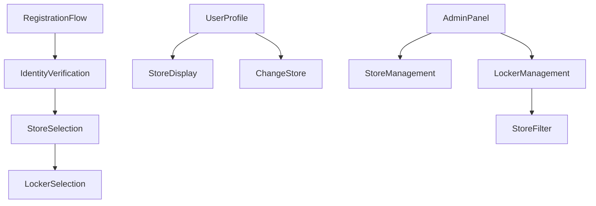
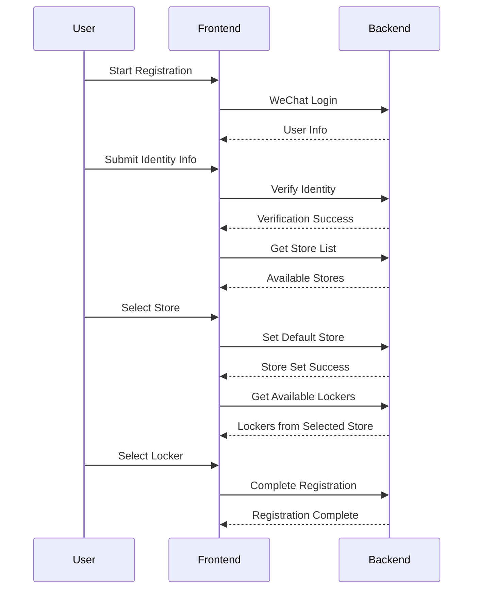

# Multi-Store Support Technical Design

## Database Design

### New Tables

#### stores
```sql
CREATE TABLE `litemall_store` (
  `id` int(11) NOT NULL AUTO_INCREMENT,
  `name` varchar(100) NOT NULL COMMENT '店铺名称',
  `code` varchar(20) NOT NULL COMMENT '店铺代码，如S001',
  `address` varchar(255) NOT NULL COMMENT '店铺地址',
  `phone` varchar(20) DEFAULT NULL COMMENT '联系电话',
  `status` varchar(20) NOT NULL DEFAULT 'active' COMMENT '状态: active/inactive/maintenance',
  `business_hours` varchar(100) DEFAULT NULL COMMENT '营业时间',
  `max_lockers` int(11) DEFAULT 100 COMMENT '最大储物柜数量',
  `notes` text COMMENT '备注信息',
  `add_time` datetime DEFAULT CURRENT_TIMESTAMP,
  `update_time` datetime DEFAULT CURRENT_TIMESTAMP ON UPDATE CURRENT_TIMESTAMP,
  `deleted` tinyint(1) DEFAULT '0',
  PRIMARY KEY (`id`),
  UNIQUE KEY `uk_code` (`code`),
  KEY `idx_status` (`status`)
) ENGINE=InnoDB DEFAULT CHARSET=utf8mb4 COMMENT='店铺表';
```

### Table Modifications

#### litemall_locker (储物柜表)
```sql
ALTER TABLE `litemall_locker` 
ADD COLUMN `store_id` int(11) NOT NULL COMMENT '所属店铺ID' AFTER `id`,
ADD KEY `idx_store_id` (`store_id`),
DROP INDEX `uk_cabinet_number`,
ADD UNIQUE KEY `uk_store_cabinet` (`store_id`, `cabinet_number`);
```

#### litemall_user (用户表)
```sql
ALTER TABLE `litemall_user`
ADD COLUMN `default_store_id` int(11) DEFAULT NULL COMMENT '默认店铺ID' AFTER `phone_verified`,
ADD KEY `idx_default_store` (`default_store_id`);
```

#### litemall_locker_operation (操作记录表)
```sql
ALTER TABLE `litemall_locker_operation`
ADD COLUMN `store_id` int(11) NOT NULL COMMENT '操作店铺ID' AFTER `locker_id`,
ADD KEY `idx_store_id` (`store_id`);
```

### Data Migration Script
```sql
-- Step 1: Create default store
INSERT INTO `litemall_store` (`name`, `code`, `address`, `phone`, `status`) 
VALUES ('耶氏体育总店', 'S001', '默认地址', '13800138000', 'active');

-- Step 2: Get default store ID
SET @default_store_id = LAST_INSERT_ID();

-- Step 3: Update existing lockers
UPDATE `litemall_locker` SET `store_id` = @default_store_id WHERE `store_id` IS NULL;

-- Step 4: Update existing operations
UPDATE `litemall_locker_operation` lo
JOIN `litemall_locker` l ON lo.locker_id = l.id
SET lo.store_id = l.store_id;

-- Step 5: Update user preferences (optional)
UPDATE `litemall_user` SET `default_store_id` = @default_store_id 
WHERE `default_store_id` IS NULL AND `identity_verified` = 1;
```

## API Design

### New Endpoints

#### 1. Get Store List
```yaml
endpoint: GET /wx/store/list
description: Get all active stores
auth: required
response:
  - id: integer
  - name: string
  - code: string
  - address: string
  - phone: string
  - businessHours: string
  - availableLockers: integer
  - totalLockers: integer
```

#### 2. Set User Default Store
```yaml
endpoint: POST /wx/user/set-store
description: Set user's default store (during registration or profile update)
auth: required
request:
  storeId: integer
response:
  success: boolean
  store:
    id: integer
    name: string
```

#### 3. Get User's Current Store
```yaml
endpoint: GET /wx/user/current-store
description: Get user's current default store
auth: required
response:
  store:
    id: integer
    name: string
    address: string
  hasActiveStorage: boolean
  canChangeStore: boolean
```

### Modified Endpoints

#### 1. Get Available Lockers
```yaml
endpoint: GET /wx/locker/available
description: Get available lockers from user's default store
changes:
  - Auto-filter by user's default_store_id
  - Add store information in response
  - Remove zone parameter (replaced by store)
```

#### 2. Store Operation
```yaml
endpoint: POST /wx/locker/store
changes:
  - Validate locker belongs to user's default store
  - Record store_id in operation
  - Include store info in response
```

#### 3. Admin Locker Management
```yaml
endpoint: GET /admin/locker/list
changes:
  - Add storeId query parameter
  - Include store information in response
  - Add store filter in request
```

## Component Architecture

### Frontend Components



### New Components

#### 1. StoreSelection Component
```javascript
// Purpose: Display store list and handle selection during registration
// Location: /components/registration/StoreSelection.vue
// Props: 
//   - stores: Array of available stores
//   - onSelect: Callback function
// Features:
//   - Display store cards with name, address
//   - Show available locker count
//   - Handle selection and confirmation
```

#### 2. StoreFilter Component
```javascript
// Purpose: Filter dropdown for admin locker management
// Location: /components/admin/StoreFilter.vue
// Props:
//   - stores: Array of all stores
//   - currentStore: Selected store ID
//   - onChange: Callback function
// Features:
//   - Dropdown with store names
//   - Show locker count per store
//   - Remember last selection
```

#### 3. StoreInfo Component
```javascript
// Purpose: Display current store information
// Location: /components/common/StoreInfo.vue
// Props:
//   - store: Store object
//   - showChangeOption: Boolean
// Features:
//   - Display store name and address
//   - Optional change store link
//   - Visual indicator for current store
```

## State Management

### User State
```javascript
{
  user: {
    id: number,
    nickname: string,
    defaultStoreId: number,
    defaultStore: {
      id: number,
      name: string,
      address: string
    },
    hasActiveStorage: boolean
  }
}
```

### Admin State
```javascript
{
  admin: {
    stores: Array<Store>,
    currentStoreFilter: number | null,
    lockers: Array<Locker>,
    filteredLockers: Array<Locker>
  }
}
```

## Registration Flow Update



## Admin Panel Updates

### Store Management Page
- CRUD operations for stores
- Set store status (active/inactive/maintenance)
- View locker statistics per store
- Bulk locker operations per store

### Locker Management Updates
- Store filter dropdown at top
- Store column in locker list
- Store selector in add/edit locker form
- Bulk operations respect store boundaries

### Operation Logs Updates
- Store column in logs table
- Store filter in search
- Export includes store information

## Performance Optimizations

### Database Indexes
```sql
-- Optimize locker queries by store
CREATE INDEX idx_locker_store_status ON litemall_locker(store_id, status);

-- Optimize operation queries by store
CREATE INDEX idx_operation_store_date ON litemall_locker_operation(store_id, add_time);

-- Optimize user store lookups
CREATE INDEX idx_user_store ON litemall_user(default_store_id);
```

### Caching Strategy
- Cache store list (TTL: 1 hour)
- Cache available locker count per store (TTL: 5 minutes)
- Invalidate cache on locker status change

## Security Considerations

1. **Store Access Control**
   - Users can only access lockers from their default store
   - Store switching requires no active storage
   - Admin can override store restrictions

2. **Data Isolation**
   - Locker queries always filtered by store
   - Operation logs respect store boundaries
   - Cross-store data access prevented at API level

3. **Audit Trail**
   - All store changes logged
   - Store ID included in all operations
   - Admin actions tracked with store context